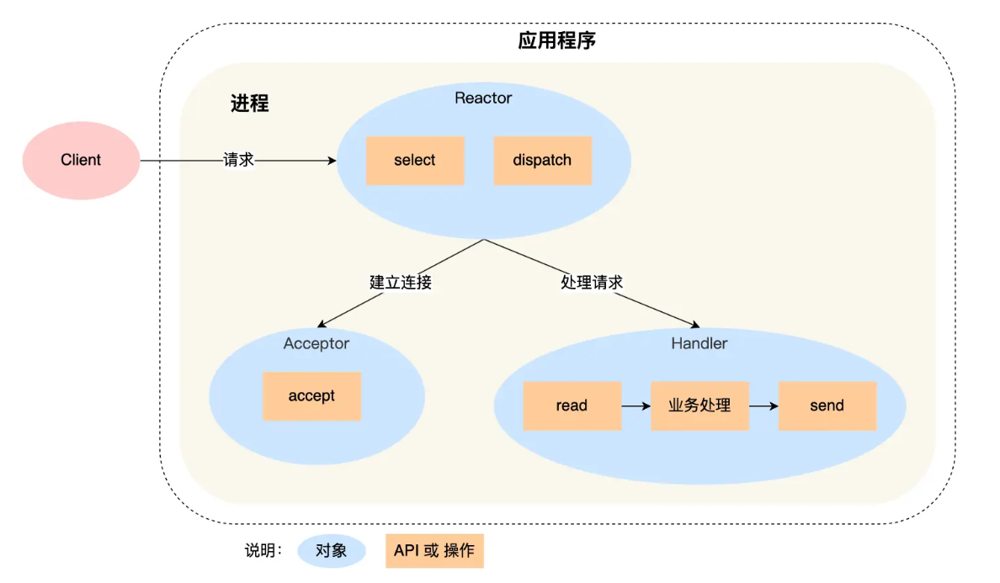
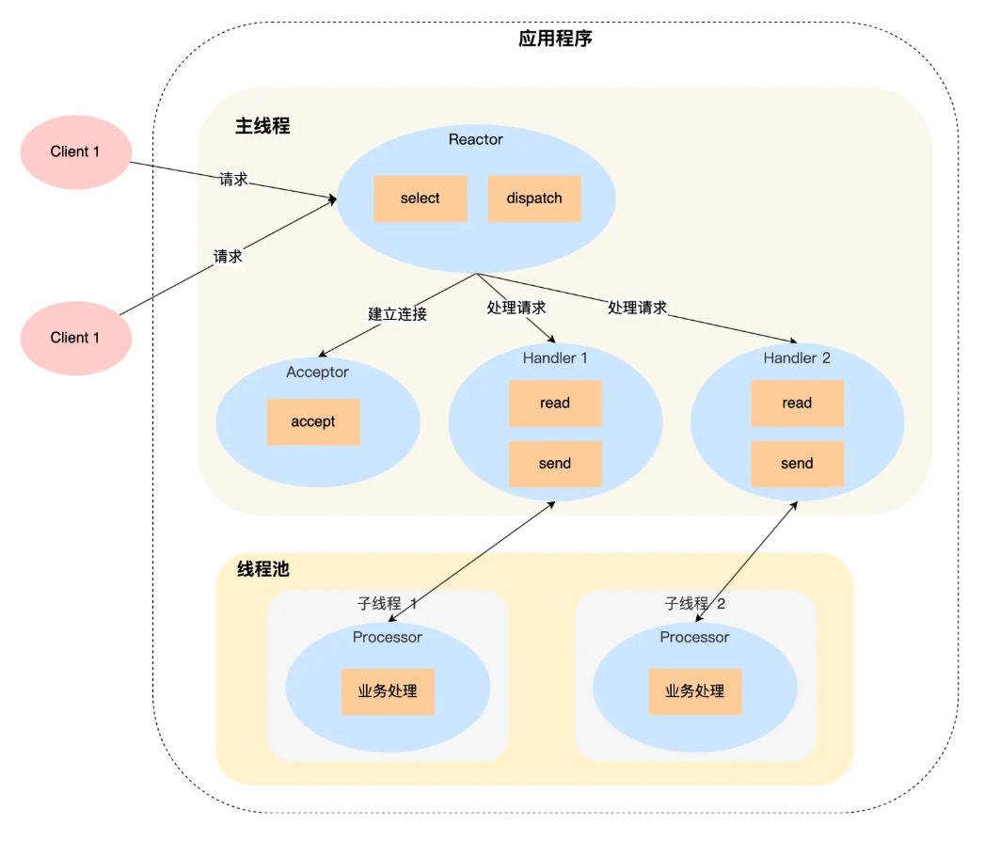
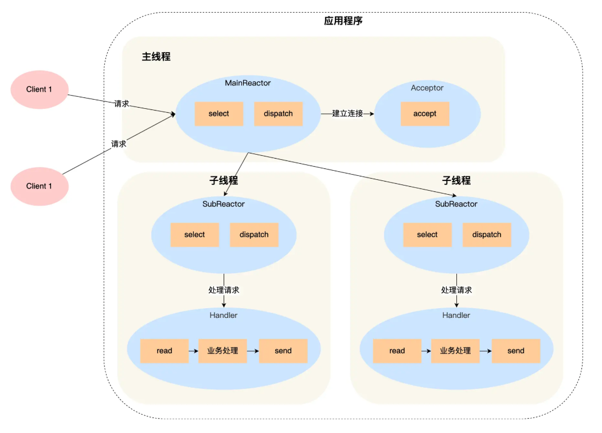

# EpollServer 组件简介


## 基础知识

### 什么是 Epoll 模式

epoll，是IO多路转接的一种模式，属于五种常用的IO模式的一种，它们分别是：

> 1. 阻塞式IO
> 2. 非阻塞式IO
> 3. IO多路复用
> 4. 信号驱动式IO
> 5. 异步IO

除去第五种是真正的异步IO，其他的都是建立在同步IO基础上实现的IO模型，而IO多路转接模型可以认为是在同步IO模型下资源利用率较大的一种机制，它可以同时等待多个文件描述符的就绪状态，而并非串行等待；

而其中的epoll模型则是IO多路转接模型下效率最高的。

### Reactor 模式和 Proactor 模式

> **Reactor 模式：应用程序主动去处理 I/O 事件。**
> **Proactor 模式：操作系统处理 I/O，应用程序只管处理结果。**

简单来说二者是同步（Reactor）和异步（Proactor）的区别，而异步编程的实现难度较高，需要调用特殊的异步IO的接口，所以我们采用同步（Reactor）模式实现；

### Reactor 模式的分类

__单Reactor 单进程/线程__



__单Reactor 多进程/线程__



__多Reactor 多进程/多线程__



## 组件介绍

这里的EpollServer在最开始实现时，目的是同Client端建立连接，并处理从Client端发来的数据，返回对应的回显消息；

但是后面做了升级，加入了网页端的内容，主要由WebServer（其内部依赖websocket协议）负责，之后EpollServer就变成了一个类似接口的类了，主要用来实现WebServer的调用接口，所以这里主要讲解EpollServer作为接口的作用；

### 关于 HTTP 方面的实现

我们知道，一个网页端的实现需要HTTP参与，即使是websocket协议，在一开始升级协议时，也需要通过HTPP发送升级请求，所以我们需要实现一个HTTP处理系统，包括HTTP报文的解析和响应报文的构建两方面。

**HTTP报文格式**
HTTP报文分为两种，一个是请求报文，一个是响应报文：

1. __请求报文__

   请求报文：请求行 + 请求头部字段 + 空行(\r\n) + [请求主体]

   - 请求行：请求方法 + 请求资源路径 + HTTP版本
   - 请求头部字段：一般是由键值对构成，包含了客户端的基本信息等
   - 空行：即\r\n，用于将请求主体和上面的内容分隔开
   - 请求主体：一般GET请求不带请求主体，而POST/PUT/PUTCH请求会带请求主体

2. __响应报文__

   响应报文：状态行 + 响应头部字段 + 响应主体

   - 状态行：HTTP版本 + 状态码 + 状态信息
   - 响应头部字段：一般是由键值对构成，包含了服务端的基本信息等
   - 空行：即\r\n，用于将请求主体和上面的内容分隔开
   - 响应主体：是服务端返回客户端的实际数据内容，通常是客户端请求资源的**核心内容部分**，常见的格式有：
     - 网页HTML源码
     - JSON数据
     - 图片、音频、视频等二进制数据
     - 文件内容（如 PDF、ZIP 等）

**具体的解析和构建方式**

1. #### 解析HTTP请求：`parseHttpRequest(const std::string& requestStr, HttpRequest& request)`函数

   __解析请求行__

   > 我们可以使用`std::getline`函数读取一整行的字符串（这里就是请求行），但是读取后如何按照空格进行分隔呢？
   >
   > 可以使用`std::istringstream`对字符串按照空格进行分隔：
   > `std::istringstream`允许像处理文件流一样处理字符串，主要用于从字符串中提取有格式的数据。它将一个字符串包装成一个流对象，然后可以使用 `>>` 运算符或其他流操作从中读取数据，常用于将按照空格分隔的字符串拆分成多个部分；

   ```C++
   // parseHttpRequest 函数对请求行进行处理的部分
   bool parseHttpRequest(const std::string& requestStr, HttpRequest& request){
       std::istringstream requestStream(requestStr);
       std::string line;
       if(std::getline(requestStream, line)){
            // 删除请求行中的回车符
   		line.erase(std::remove(line.begin(), line.end(), '\r'), line.end());
           std::istringstream requestLineStream(line);
           std::string method, resource, version;
           requestLineStream >> method >> resource >> version;
           
           // 剩余部分
           // ...
       }
   }
   ```

   为了更方便的表示HTTP各部分结构，我们定义了一个结构体，用来存储每一个HTTP请求的相关信息：

   ```c++
   struct HttpRequest {
           HttpMethod method; 								// 请求方法
           std::string path;								// 请求资源路径 
           std::string version;							// HTTP版本
           std::map<std::string, std::string> headers;		  // string -> string, 请求头部信息, 键值对映射表
           std::string body;								// 请求主体 
           std::map<std::string, std::string> queryParams;	   // 用于解析资源请求路径中的查询参数
       												  // 一般以?开始, &分隔不同键值对, =连接键值对
   };
   ```

   解析路径和查询参数（即构建std::map<string, string> queryParams的映射关系）：

   ```c++
   size_t queryPos = path.find('?');
   if (queryPos != std::string::npos) {
       std::string queryString = path.substr(queryPos + 1);
       path = path.substr(0, queryPos);
       
       std::istringstream queryStream(queryString);
       std::string param;
       while (std::getline(queryStream, param, '&')) {
           size_t equalPos = param.find('=');
           if (equalPos != std::string::npos) {
               std::string key = param.substr(0, equalPos);
               std::string value = param.substr(equalPos + 1);
               request.queryParams[key] = value;
           }
       }
   }
   ```

   完整的解析请求行的代码：

   ```c++
   std::istringstream requestStream(requestStr);
       std::string line;
       
       // 解析请求行
       if (std::getline(requestStream, line)) {
           line.erase(std::remove(line.begin(), line.end(), '\r'), line.end());
           std::istringstream requestLineStream(line);
           std::string method, path, version;
           requestLineStream >> method >> path >> version;
           
           // 设置请求方法
           if (method == "GET") request.method = HttpMethod::GET;
           else if (method == "POST") request.method = HttpMethod::POST;
           else if (method == "PUT") request.method = HttpMethod::PUT;
           else if (method == "DELETE") request.method = HttpMethod::DELETE;
           else if (method == "OPTIONS") request.method = HttpMethod::OPTIONS;
           else request.method = HttpMethod::UNKNOWN;
           
           // 解析路径和查询参数
           size_t queryPos = path.find('?');
           if (queryPos != std::string::npos) {
               std::string queryString = path.substr(queryPos + 1);
               path = path.substr(0, queryPos);
               
               std::istringstream queryStream(queryString);
               std::string param;
               while (std::getline(queryStream, param, '&')) {
                   size_t equalPos = param.find('=');
                   if (equalPos != std::string::npos) {
                       std::string key = param.substr(0, equalPos);
                       std::string value = param.substr(equalPos + 1);
                       request.queryParams[key] = value;
                   }
               }
           }
           
           request.path = path;
           request.version = version;
       } else {
           return false;
       }
   	// ...
   }
   ```

   __解析请求头__

   请求头的键值对之间用\r\n隔开，而单个的键值对间使用:进行分隔，处理时注意找到对应标志即可，

   请求头的解析比请求行简单，需要注意前导空格的处理；

   ```c++
   // 解析请求头
   while (std::getline(requestStream, line) && !line.empty() && line != "\r") {
       line.erase(std::remove(line.begin(), line.end(), '\r'), line.end());
       size_t colonPos = line.find(':');
       if (colonPos != std::string::npos) {
           std::string key = line.substr(0, colonPos);
           std::string value = line.substr(colonPos + 1);
           // 去除前导空格
           value.erase(0, value.find_first_not_of(" \t"));
           // 构建 key-value 映射关系
           request.headers[key] = value;
       }
   }
   ```

   __解析请求体__

   使用与`std::istringstream`对应的`std::ostringstream`即可

   ```c++
   // 解析请求体
   std::ostringstream bodyStream;
   while (std::getline(requestStream, line)) {
       bodyStream << line << "\n";
   }
   request.body = bodyStream.str();
   ```

2. #### 处理HTTP请求报文

   在完成上面对HTTP的解析后，就需要对解析后的请求报文进行处理，返回客户端请求的对应资源：

   对于不同的请求方法来说，有着不同的处理方式，所以需要建立一个请求方法和对应的回调函数的映射关系：

   ```c++
   std::map<std::string, RequestHandler> _getHandlers;   // GET 请求处理器
   std::map<std::string, RequestHandler> _postHandlers;  // POST 请求处理器
   ```

   对应的有设置回调的函数：

   ```c++
   void addGetHandler(const std::string& path, RequestHandler handler);
   void addPostHandler(const std::string& path, RequestHandler handler);
   ```

   但是这里的EpollServer只作为一个接口类存在，所以没有对应的设置回调逻辑，所有对回调函数的处理都在WebServer中执行

   // TODO: 建立EpollServer -> WebServer的链接

   当回调函数处理完成后，如果直接向客户端发送处理后的内容，客户端时无法正确解析的，因为所有的HTTP报文都需要遵循响应的格式，所以还需要实现一个序列化函数，将处理结果序列化生成一个标准格式的HTTP响应报文

   ```c++
   std::string EpollServer::serializeHttpResponse(const HttpResponse& response) {
       std::ostringstream responseStream;
       
       // 状态行
       responseStream << "HTTP/1.1 " << response.statusCode << " " << response.statusText << "\r\n";
       
       // 响应头
       for (const auto& header : response.headers) {
           responseStream << header.first << ": " << header.second << "\r\n";
       }
       
       // 空行分隔
       responseStream << "\r\n";
       
       // 响应体
       responseStream << response.body;
       
       return responseStream.str();
   }
   
   ```

   序列化之后的响应报文就可以被客户端正确解析，这样我们就完成了基于HTTP协议的服务端-客户端网络通信功能（这里的客户端就是浏览器，其具有解析HTTP响应报文 [格式正确] 的能力）

### 关于websocket协议的升级（TODO）

我们的网页端是基于websocket协议实现的，而websocket协议需要在原有HTTP协议上进行升级操作，具体的升级请求报文也需要进行特殊处理，所以就需要一个专门的模块实现升级操作；

### 关于客户端连接请求的处理（TODO）

一个服务端想要运行，必须要能够接受客户端的访问请求，所以我们基于上面介绍的Reactor + epoll多路复用机制实现客户端连接等请求处理的机制；

### 其他的优化机制（TODO）

通过上面的实现，我们就可以完成一个简易的网站搭建和请求处理业务了，但是性能实在单一，功能也残缺不全，所以就引出了我们对于上述实现的进一步优化机制，常见的有session机制，cookie机制等

